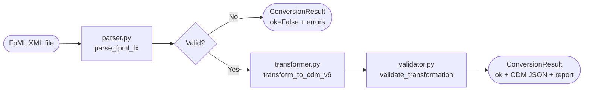
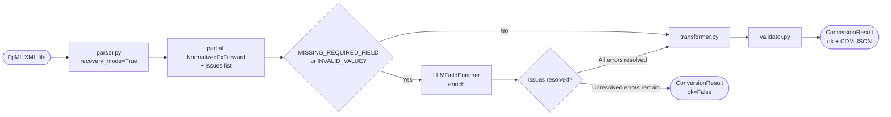
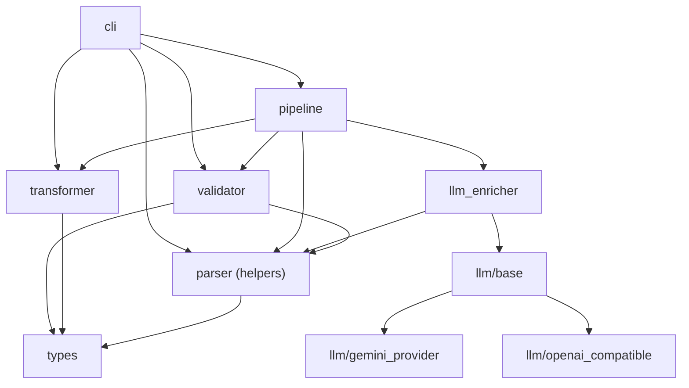
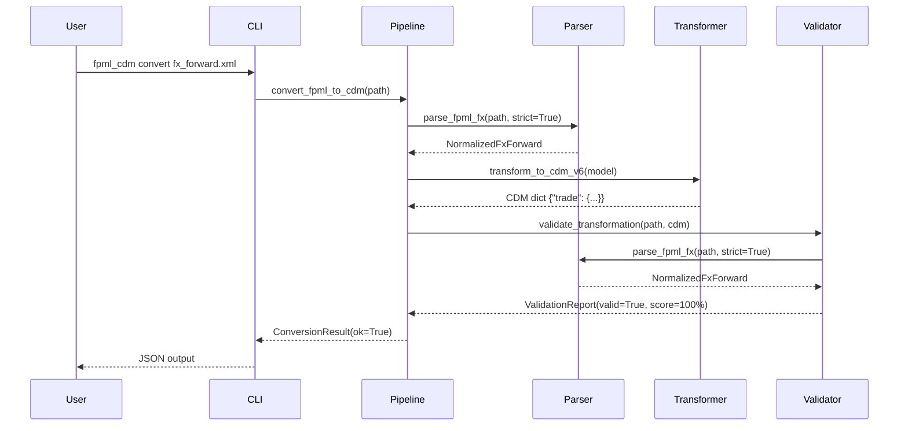
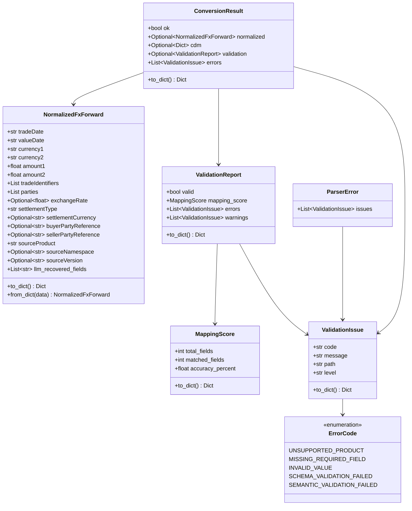
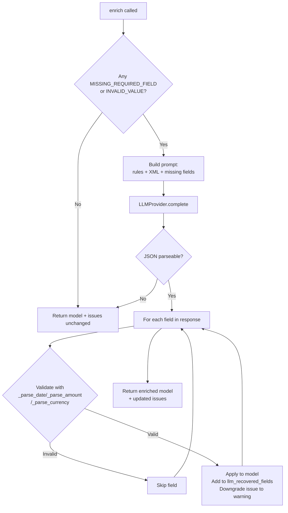
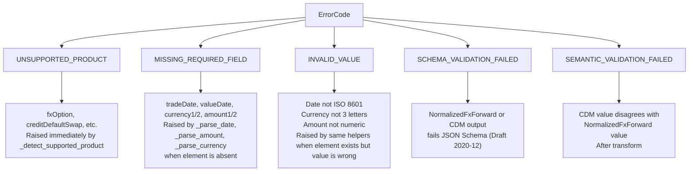

# FpML → ISDA CDM Conversion Pipeline

A reference implementation of a deterministic, fully auditable converter from FpML FX Forward XML to ISDA CDM v6 JSON, with an optional LLM-powered field recovery layer for partial or non-standard documents.

---

## Table of Contents

1. [Concept](#1-concept)
2. [Supported Products](#2-supported-products)
3. [Repository Layout](#3-repository-layout)
4. [Pipeline Architecture](#4-pipeline-architecture)
5. [Data Model](#5-data-model)
6. [Module Reference](#6-module-reference)
   - [fpml_cdm/types.py](#fpml_cdmtypespy)
   - [fpml_cdm/parser.py](#fpml_cdmparserpy)
   - [fpml_cdm/transformer.py](#fpml_cdmtransformerpy)
   - [fpml_cdm/validator.py](#fpml_cdmvalidatorpy)
   - [fpml_cdm/pipeline.py](#fpml_cdmpipelinepy)
   - [fpml_cdm/llm_enricher.py](#fpml_cdmllm_enricherpy)
   - [fpml_cdm/llm/](#fpml_cdmllm)
   - [fpml_cdm/cli.py](#fpml_cdmclipy)
7. [FpML → CDM Field Mapping](#7-fpml--cdm-field-mapping)
8. [LLM Enrichment Layer](#8-llm-enrichment-layer)
9. [Schemas](#9-schemas)
10. [Test Suite](#10-test-suite)
11. [Scripts & Corpus Operations](#11-scripts--corpus-operations)
12. [CLI Reference](#12-cli-reference)
13. [Error Taxonomy](#13-error-taxonomy)
14. [Next Steps](#14-next-steps)

---

## 1. Concept

**FpML** (Financial products Markup Language) is the XML-based industry standard for representing OTC derivatives trades. It is produced by systems like trade capture platforms, confirmation engines, and middle-office systems.

**ISDA CDM** (Common Domain Model) is the next-generation, vendor-neutral data model for financial contracts maintained by ISDA. CDM v6 uses a deeply nested JSON representation that is designed to be language- and system-agnostic.

The conversion pipeline bridges the two standards for the FX Forward asset class:

```
FpML 4.x / 5.x XML  ──►  Normalised intermediate  ──►  CDM v6 JSON
                          (NormalizedFxForward)
```

Design principles:

| Principle | Implication |
|-----------|-------------|
| **Deterministic** | Same XML always produces the same CDM JSON. No randomness, no timestamps. |
| **Auditable** | Every field carries a `ValidationIssue` explaining exactly what was found or missing. |
| **Namespace-agnostic** | The parser resolves fields by local XML tag name, so FpML 4.x and 5.x (and any namespace variant) are handled identically. |
| **Fail-fast by default** | `strict=True` raises a structured `ParserError` on the first bad field, preventing silent data corruption. |
| **LLM as fallback only** | The deterministic path is always the primary path. LLM enrichment is opt-in and tagged, so recovered fields are traceable. |

---

## 2. Supported Products

| FpML element | CDM mapping | Notes |
|---|---|---|
| `<fxForward>` | `SettlementPayout` (PHYSICAL) | Standard deliverable FX forward |
| `<fxSingleLeg>` | `SettlementPayout` (PHYSICAL) | Single-leg FX, same structure |
| `<fxForward>` + `<nonDeliverableSettlement>` | `SettlementPayout` (CASH) | NDF — adds `settlementCurrency` |
| `<fxForward>` + `<nonDeliverableForward>` | `SettlementPayout` (CASH) | NDF variant (FpML 4.x name) |

All other product types (options, swaps, swaptions, credit, etc.) are rejected immediately with `UNSUPPORTED_PRODUCT`.

---

## 3. Repository Layout

```
fpml_isdacdm/
├── fpml_cdm/                   # Main Python package
│   ├── __init__.py             # Public API surface
│   ├── __main__.py             # python -m fpml_cdm entry point
│   ├── types.py                # Data classes and error types
│   ├── parser.py               # FpML XML → NormalizedFxForward
│   ├── transformer.py          # NormalizedFxForward → CDM v6 dict
│   ├── validator.py            # Schema + semantic validation
│   ├── pipeline.py             # Orchestration (parse → transform → validate)
│   ├── cli.py                  # argparse CLI (parse / transform / validate / convert)
│   ├── llm_enricher.py         # LLM field recovery layer
│   └── llm/
│       ├── __init__.py         # Re-exports
│       ├── base.py             # LLMProvider Protocol + NullProvider + factory
│       ├── gemini_provider.py  # Google Gemini backend
│       └── openai_compatible.py # OpenAI-compatible HTTP backend (Ollama, LM Studio, …)
│
├── schemas/
│   ├── fpml_fx_forward_parsed.schema.json   # JSON Schema for NormalizedFxForward
│   └── cdm_fx_forward.schema.json           # JSON Schema for CDM v6 output
│
├── tests/
│   ├── fixtures/fpml/          # Input XML fixtures
│   ├── fixtures/expected/      # Expected parsed/CDM JSON outputs
│   ├── test_parser.py
│   ├── test_transformer.py
│   ├── test_validator.py
│   ├── test_pipeline.py
│   └── test_llm_enricher.py
│
├── scripts/
│   ├── import_fpml_corpus.py   # Downloads official FpML examples
│   └── run_local_corpus_check.py # Batch conversion check
│
├── data/
│   ├── corpus/fpml_official/   # Downloaded XML corpus (gitignored)
│   └── corpus/reports/         # Corpus check reports (JSON)
│
├── .agent/skills/fpml-to-cdm-fx-forward/references/
│   ├── FPML_STRUCTURE.md
│   ├── CDM_STRUCTURE.md
│   ├── MAPPING_REFERENCE.md
│   ├── ENUM_MAPPINGS.md
│   ├── JAVA_PATTERNS.md
│   └── LLM_RECOVERY_RULES.md   # Rules injected into every LLM recovery prompt
│
├── Makefile
├── requirements.txt
└── CLAUDE.md
```

---

## 4. Pipeline Architecture

### Standard (deterministic) path



### With LLM enrichment



### Module dependency graph



### Sequence: full successful conversion



---

## 5. Data Model



`NormalizedFxForward` is the pivot type of the entire pipeline. It is the only thing that flows between the three stages. Every stage either produces it, consumes it, or both.

`llm_recovered_fields` is provenance metadata — it is excluded from `to_dict()` so it never leaks into the CDM output or the schema-validated payload.

---

## 6. Module Reference

### `fpml_cdm/types.py`

Pure data classes. No I/O, no imports beyond stdlib.

```python
class ErrorCode(str, Enum):
    UNSUPPORTED_PRODUCT      = "UNSUPPORTED_PRODUCT"
    MISSING_REQUIRED_FIELD   = "MISSING_REQUIRED_FIELD"
    INVALID_VALUE            = "INVALID_VALUE"
    SCHEMA_VALIDATION_FAILED = "SCHEMA_VALIDATION_FAILED"
    SEMANTIC_VALIDATION_FAILED = "SEMANTIC_VALIDATION_FAILED"

@dataclass
class ValidationIssue:
    code: str
    message: str
    path: str = ""
    level: str = "error"          # "error" | "warning"

@dataclass
class MappingScore:
    total_fields: int = 0
    matched_fields: int = 0
    accuracy_percent: float = 0.0

@dataclass
class ValidationReport:
    valid: bool
    mapping_score: MappingScore
    errors: List[ValidationIssue]
    warnings: List[ValidationIssue]

@dataclass
class NormalizedFxForward:
    tradeDate: str
    valueDate: str
    currency1: str
    currency2: str
    amount1: float
    amount2: float
    tradeIdentifiers: List[Dict[str, str]]
    parties: List[Dict[str, Optional[str]]]
    exchangeRate: Optional[float]
    settlementType: str                       # "PHYSICAL" | "CASH"
    settlementCurrency: Optional[str]
    buyerPartyReference: Optional[str]
    sellerPartyReference: Optional[str]
    sourceProduct: str                        # "fxForward" | "fxSingleLeg"
    sourceNamespace: Optional[str]
    sourceVersion: Optional[str]
    llm_recovered_fields: List[str]           # provenance only, excluded from to_dict()

@dataclass
class ConversionResult:
    ok: bool
    normalized: Optional[NormalizedFxForward]
    cdm: Optional[Dict[str, Any]]
    validation: Optional[ValidationReport]
    errors: List[ValidationIssue]

class ParserError(Exception):
    issues: List[ValidationIssue]
```

---

### `fpml_cdm/parser.py`

Parses FpML XML into `NormalizedFxForward`. Uses local-name traversal (`_local_name`, `_find_child_local`, `_find_descendant_local`) so it is fully namespace-agnostic — FpML 4.x and 5.x are handled identically.

**Key private helpers:**

```python
def _normalize_date_only(value: str) -> Optional[str]
# Strips trailing Z, accepts ISO 8601 date-only strings. Returns None on failure.

def _parse_date(value: Optional[str], path: str, issues: List[ValidationIssue]) -> Optional[str]
# Validates and returns an ISO date string. Appends MISSING_REQUIRED_FIELD or INVALID_VALUE to issues.

def _parse_amount(value: Optional[str], path: str, issues: List[ValidationIssue]) -> Optional[float]
# Parses a numeric string. Appends issues on failure.

def _parse_currency(value: Optional[str], path: str, issues: List[ValidationIssue]) -> Optional[str]
# Validates a 3-letter ISO currency code. Appends issues on failure.

def _detect_supported_product(trade: ET.Element) -> Tuple[str, ET.Element]
# Scans children of <trade>. Returns (product_name, product_element).
# Raises ParserError with UNSUPPORTED_PRODUCT for any other element.
```

**Public API:**

```python
def parse_fpml_fx(
    xml_path: str,
    strict: bool = True,
    recovery_mode: bool = False,
) -> NormalizedFxForward | Tuple[NormalizedFxForward, List[ValidationIssue]]
# Reads file from disk, delegates to parse_fpml_root.
# recovery_mode=True: never raises, always returns (model, issues) tuple.

def parse_fpml_xml(
    xml_content: str,
    strict: bool = True,
    recovery_mode: bool = False,
) -> NormalizedFxForward | Tuple[NormalizedFxForward, List[ValidationIssue]]
# Same as parse_fpml_fx but accepts raw XML string.

def parse_fpml_root(
    root: ET.Element,
    strict: bool = True,
    recovery_mode: bool = False,
) -> NormalizedFxForward | Tuple[NormalizedFxForward, List[ValidationIssue]]
# Core parsing logic. Called by both parse_fpml_fx and parse_fpml_xml.
```

**`strict` vs `recovery_mode`:**

| Mode | Behaviour |
|------|-----------|
| `strict=True` (default) | Raises `ParserError` on any issue |
| `strict=False` | Only raises on error-level issues (warnings are tolerated) |
| `recovery_mode=True` | Never raises. Always returns `(model, issues)`. Missing fields produce empty/zero values so the model is always constructible. |

---

### `fpml_cdm/transformer.py`

Pure function. No I/O, no side effects. Maps `NormalizedFxForward` → CDM v6 `{"trade": {...}}` dict.

```python
def transform_to_cdm_v6(model: NormalizedFxForward) -> Dict
```

The CDM output structure is fixed:

```
trade
├── tradeDate.value
├── tradeIdentifier[].assignedIdentifier[].identifier.value
├── party[].partyId[].identifier.value / name.value
└── tradableProduct
    ├── product.nonTransferableProduct.economicTerms.payout.settlementPayout[]
    │   ├── settlementTerms.settlementDate.adjustableOrAdjustedDate.unadjustedDate.value
    │   ├── settlementTerms.settlementType
    │   ├── settlementTerms.settlementCurrency.value          (NDF only)
    │   └── payerReceiver.payer/receiver.globalReference      (if buyer/seller present)
    └── tradeLot[0].priceQuantity[0]
        ├── price[0].value.value / unit.currency.value / perUnitOf.currency.value
        ├── quantity[0].value.value / unit.currency.value     (currency1/amount1)
        └── quantity[1].value.value / unit.currency.value     (currency2/amount2)
```

---

### `fpml_cdm/validator.py`

Two complementary validation strategies run on every conversion:

**Schema validation** — checks structure against JSON Schema (Draft 2020-12):

```python
def validate_schema_data(schema_name: str, data: Dict[str, Any]) -> List[ValidationIssue]
# Validates data against schemas/<schema_name>. Returns list of SCHEMA_VALIDATION_FAILED issues.

def validate_schema_file(schema_name: str, json_path: str) -> List[ValidationIssue]
# Same but loads data from a file path.
```

**Semantic validation** — field-by-field cross-check of `NormalizedFxForward` vs the CDM dict:

```python
def _semantic_validation(
    model: NormalizedFxForward,
    cdm_data: Dict[str, Any],
) -> Tuple[List[ValidationIssue], MappingScore]
# Checks: tradeDate, valueDate, settlementType, currency1/2, amount1/2,
#         exchangeRate, rate base/quote currencies, settlementCurrency (NDF),
#         buyerPartyReference, sellerPartyReference.
# Returns issues + MappingScore with accuracy_percent.
```

**Orchestrating entry points:**

```python
def validate_transformation(fpml_path: str, cdm_obj: Dict[str, Any]) -> ValidationReport
# Re-parses the source FpML, then runs schema + semantic validation.
# Used by pipeline.py after every transform.

def validate_conversion_files(fpml_path: str, cdm_json_path: str) -> ValidationReport
# Same but accepts CDM as a file path. Used by the 'validate' CLI subcommand.
```

---

### `fpml_cdm/pipeline.py`

Orchestrates the full pipeline. This is the main entry point for programmatic use.

```python
def convert_fpml_to_cdm(
    fpml_path: str,
    strict: bool = True,
    llm_provider: Optional[LLMProvider] = None,
) -> ConversionResult
```

When `llm_provider` is `None` (default), the pipeline is:

```
parse_fpml_fx(strict) → transform_to_cdm_v6 → validate_transformation
```

When `llm_provider` is set, the pipeline is:

```
parse_fpml_fx(recovery_mode=True) → LLMFieldEnricher.enrich → [check errors]
→ transform_to_cdm_v6 → validate_transformation
```

```python
def extract_first_issue_message(result: ConversionResult) -> Optional[str]
# Convenience helper for logging: returns "CODE: message" from the first error.
```

---

### `fpml_cdm/llm_enricher.py`

Stateless class that wraps an `LLMProvider` and attempts to recover fields that the deterministic parser marked as `MISSING_REQUIRED_FIELD` or `INVALID_VALUE`.

```python
class LLMFieldEnricher:
    def __init__(
        self,
        provider: LLMProvider,
        rules_path: Optional[str] = None,   # path to LLM_RECOVERY_RULES.md
    ) -> None

    def enrich(
        self,
        xml_content: str,
        partial_model: NormalizedFxForward,
        issues: List[ValidationIssue],
    ) -> Tuple[NormalizedFxForward, List[ValidationIssue]]
    # Returns (enriched_model, updated_issues).
    # Resolved issues are downgraded level: "error" → "warning"
    # with message prefix "LLM-recovered: ...".
    # Unresolved issues are unchanged.
    # Recovered field names are appended to model.llm_recovered_fields.
```

The enricher builds a single prompt containing:
1. The full `LLM_RECOVERY_RULES.md`
2. The raw XML content
3. The list of missing/invalid field paths

It then parses the LLM's JSON response (handling raw JSON, markdown code fences, and inline JSON blocks), validates each value with the same `_parse_date` / `_parse_amount` / `_parse_currency` helpers used by the deterministic parser, and applies only the values that pass validation.



---

### `fpml_cdm/llm/`

#### `base.py`

```python
class LLMProvider(Protocol):
    def complete(self, prompt: str) -> str: ...
    # Single-method protocol. Any object with complete() is a valid provider.

class NullProvider:
    def complete(self, prompt: str) -> str: ...
    # No-op. Returns empty string. Used when LLM is disabled.

def get_llm_provider(
    provider_name: Optional[str] = None,    # "none" | "gemini" | "openai_compat"
    model: Optional[str] = None,
    base_url: Optional[str] = None,
    api_key: Optional[str] = None,
) -> LLMProvider
```

Environment variable configuration:

| Variable | Default | Description |
|---|---|---|
| `FPML_CDM_LLM_PROVIDER` | `none` | Active provider |
| `FPML_CDM_LLM_MODEL` | provider-specific | Model name |
| `GEMINI_API_KEY` | — | Required for `gemini` |
| `FPML_CDM_LLM_BASE_URL` | `http://localhost:11434/v1` | For `openai_compat` |
| `FPML_CDM_LLM_API_KEY` | — | Optional for `openai_compat` |

#### `gemini_provider.py`

```python
class GeminiProvider:
    def __init__(self, model: str = "gemini-2.5-flash") -> None
    def complete(self, prompt: str) -> str
    # Requires: pip install google-generativeai>=0.8.0
    # Requires: GEMINI_API_KEY env var
```

#### `openai_compatible.py`

```python
class OpenAICompatProvider:
    def __init__(
        self,
        base_url: str = "http://localhost:11434/v1",
        model: str = "llama3.2",
        api_key: str = "",
    ) -> None
    def complete(self, prompt: str) -> str
    # POSTs to {base_url}/chat/completions. temperature=0, stream=False.
    # Works with: Ollama, LM Studio, vLLM, any OpenAI-compatible server.
    # Requires: pip install requests>=2.31.0
```

---

### `fpml_cdm/cli.py`

argparse CLI. Entry point: `python -m fpml_cdm <subcommand>`.

```
parse    <input.xml> [--output <out.json>] [--no-strict]
transform <parsed.json> [--output <cdm.json>]
validate  --fpml <f.xml> --cdm <cdm.json> [--output <report.json>]
convert   <input.xml> [--output <result.json>]
           [--normalized-output <n.json>] [--cdm-output <cdm.json>]
           [--report-output <report.json>]
           [--no-strict]
           [--llm-provider none|gemini|openai_compat]
           [--llm-base-url http://localhost:11434/v1]
           [--llm-model llama3.2]
```

**Key functions:**

```python
def cmd_parse(args: argparse.Namespace) -> int
def cmd_transform(args: argparse.Namespace) -> int
def cmd_validate(args: argparse.Namespace) -> int
def cmd_convert(args: argparse.Namespace) -> int

def _resolve_llm_provider(args: argparse.Namespace) -> Optional[LLMProvider]
# Reads --llm-provider, --llm-base-url, --llm-model from args.
# Returns None for "none". Returns a configured provider otherwise.

def build_parser() -> argparse.ArgumentParser
def main(argv: list[str] | None = None) -> int
```

---

## 7. FpML → CDM Field Mapping

| FpML path | CDM path | Notes |
|---|---|---|
| `tradeHeader/tradeDate` | `trade.tradeDate.value` | ISO date |
| `partyTradeIdentifier/tradeId` | `trade.tradeIdentifier[n].assignedIdentifier[0].identifier.value` | Repeating |
| `party/@id` | `trade.party[n].partyId[0].identifier.value` | |
| `party/partyName` | `trade.party[n].name.value` | Fallback: `partyId` text |
| `exchangedCurrency1/paymentAmount/currency` | `...quantity[0].unit.currency.value` | |
| `exchangedCurrency1/paymentAmount/amount` | `...quantity[0].value.value` | |
| `exchangedCurrency2/paymentAmount/currency` | `...quantity[1].unit.currency.value` | |
| `exchangedCurrency2/paymentAmount/amount` | `...quantity[1].value.value` | |
| `exchangeRate/rate` | `...price[0].value.value` | Optional |
| `exchangeRate/rate` quote currency | `...price[0].unit.currency.value` | = currency2 |
| `exchangeRate/rate` base currency | `...price[0].perUnitOf.currency.value` | = currency1 |
| `valueDate` | `...settlementTerms.settlementDate.adjustableOrAdjustedDate.unadjustedDate.value` | |
| `nonDeliverableSettlement/settlementCurrency` | `...settlementTerms.settlementCurrency.value` | NDF only |
| `buyerPartyReference/@href` | `...settlementPayout[0].payerReceiver.payer.globalReference` | |
| `sellerPartyReference/@href` | `...settlementPayout[0].payerReceiver.receiver.globalReference` | |

Settlement type mapping:

| NormalizedFxForward.settlementType | CDM value |
|---|---|
| `PHYSICAL` | `SettlementTypeEnum.PHYSICAL` |
| `CASH` | `SettlementTypeEnum.CASH` |
| `REGULAR` | `SettlementTypeEnum.REGULAR` |

---

## 8. LLM Enrichment Layer

The LLM layer is an optional, opt-in addition to the deterministic pipeline. It activates only when:

1. `llm_provider` is passed to `convert_fpml_to_cdm` (not `None`), and
2. The parser produced at least one `MISSING_REQUIRED_FIELD` or `INVALID_VALUE` issue.

### Recovery Rules

The file `.agent/skills/fpml-to-cdm-fx-forward/references/LLM_RECOVERY_RULES.md` is injected verbatim into every prompt. It defines:

- Primary and alternative XML paths for every required field
- Derivation rule: if `exchangeRate` is missing but both amounts are present, `rate = amount2 / amount1`
- Party role inference from `payerPartyReference` / `receiverPartyReference`
- Date format normalisation table (`DD-Mon-YYYY`, `DD/MM/YYYY`, etc. → `YYYY-MM-DD`)
- Currency name → ISO code table (`Euro` → `EUR`)
- Amount cleaning rules (comma separators, currency symbols)
- Strict output contract: the model must only return fields it found with high confidence

### Strict output contract

The LLM is instructed to return **only** a flat JSON object:

```json
{ "valueDate": "2024-09-25", "exchangeRate": "1.36" }
```

Fields the LLM cannot find with high confidence must be **omitted**. No guessing.

Every value returned by the LLM is validated through the same deterministic helpers (`_normalize_date_only`, `_parse_amount`, `_parse_currency`) before being applied to the model. A bad LLM value is silently dropped; the issue remains an error.

### Traceability

Recovered fields are visible in two places:
- `model.llm_recovered_fields` — list of field names recovered by LLM
- The corresponding `ValidationIssue` is downgraded to `level="warning"` with message prefix `"LLM-recovered: ..."`, so callers can distinguish LLM-assisted fields from deterministically-parsed ones.

---

## 9. Schemas

Two JSON Schema files (Draft 2020-12) live under `schemas/`:

| File | Validates |
|---|---|
| `fpml_fx_forward_parsed.schema.json` | `NormalizedFxForward.to_dict()` output |
| `cdm_fx_forward.schema.json` | CDM v6 `{"trade": {...}}` output |

Both are validated on every call to `validate_transformation`. A schema mismatch produces a `SCHEMA_VALIDATION_FAILED` issue. Schema validation runs **after** semantic validation, so both kinds of errors are reported together.

---

## 10. Test Suite

24 tests across 5 modules. Run with `make check`.

```
tests/
├── test_parser.py        (6 tests)
├── test_transformer.py   (3 tests)
├── test_validator.py     (4 tests)
├── test_pipeline.py      (4 tests)
└── test_llm_enricher.py  (7 tests)
```

### `test_parser.py`

| Test | Fixture | What it checks |
|---|---|---|
| `test_parse_fx_forward_matches_expected` | `fx_forward.xml` | Exact match vs `fx_forward_parsed.json` |
| `test_parse_fx_single_leg_supported` | `fx_single_leg.xml` | `sourceProduct="fxSingleLeg"`, currencies |
| `test_parse_ndf_sets_cash_settlement` | `ndf_forward.xml` | `settlementType="CASH"`, `settlementCurrency` |
| `test_parse_invalid_date_raises_structured_error` | `invalid_date.xml` | `INVALID_VALUE` code present |
| `test_parse_missing_value_date_raises_structured_error` | `missing_value_date.xml` | `MISSING_REQUIRED_FIELD` code present |
| `test_parse_unsupported_product_rejected` | `unsupported_fx_digital_option.xml` | `UNSUPPORTED_PRODUCT` code |

### `test_transformer.py`

| Test | What it checks |
|---|---|
| `test_transform_matches_expected_forward_shape` | Exact match vs `fx_forward_cdm.json` |
| `test_transform_ndf_includes_settlement_currency` | `settlementType=CASH`, `settlementCurrency` present |
| `test_transform_missing_exchange_rate_keeps_valid_schema` | CDM schema is valid even with no rate |

### `test_validator.py`

| Test | What it checks |
|---|---|
| `test_validate_transformation_success_path` | `valid=True`, `accuracy_percent=100.0` |
| `test_validate_detects_semantic_mismatch` | Mutated CDM → `SEMANTIC_VALIDATION_FAILED` |
| `test_validate_detects_schema_mismatch` | Wrong CDM shape → `SCHEMA_VALIDATION_FAILED` |
| `test_validate_returns_structured_error_for_unsupported_source` | Unsupported FpML → `UNSUPPORTED_PRODUCT` |

### `test_pipeline.py`

| Test | What it checks |
|---|---|
| `test_convert_pipeline_success` | End-to-end: `ok=True`, all fields populated |
| `test_convert_is_deterministic_across_runs` | 3 runs produce identical SHA-256 hashes |
| `test_convert_rejects_unsupported_product` | `ok=False`, `UNSUPPORTED_PRODUCT` in errors |
| `test_cli_convert_command_passes` | subprocess exit code 0 |

### `test_llm_enricher.py`

| Test | What it checks |
|---|---|
| `test_successful_recovery_patches_model` | Valid valueDate recovered, issue downgraded to warning |
| `test_recovery_with_non_standard_date_format` | LLM pre-normalised date accepted |
| `test_malformed_json_response_leaves_model_unchanged` | Non-JSON response → model unchanged |
| `test_invalid_date_value_rejected` | `"not-a-date"` → validation fails, model unchanged |
| `test_field_not_in_llm_response_unchanged` | Empty JSON `{}` → model unchanged |
| `test_no_recoverable_issues_skips_llm` | No issues → LLM provider never called |
| `test_json_extracted_from_markdown_fence` | ` ```json ... ``` ` response parsed correctly |

---

## 11. Scripts & Corpus Operations

### `scripts/import_fpml_corpus.py`

Downloads official FpML XML example files from fpml.org HTML index pages into a local directory for repeatable batch testing.

```
make corpus-import
# → data/corpus/fpml_official/{fpml_5_12_4_confirmation,fpml_4_9_5}/...
```

Sources (hardcoded in `DEFAULT_SOURCES`):
- FpML 5.12.4 confirmation examples
- FpML 4.9.5 examples

```python
def run_import(dest, force, selected_sources, limit_per_source) -> Dict
# Returns a manifest with download counts, failures, timing.
```

### `scripts/run_local_corpus_check.py`

Runs `convert_fpml_to_cdm` over every XML file under the corpus directory and writes a JSON summary report.

```
make corpus-check       # all products
make corpus-check-fx    # filter: path contains "/fx-derivatives/"
```

```python
def build_report(corpus, files, sample_errors) -> Dict
# Returns: files_processed, status_counts {ok, failed},
#          error_code_counts, mapping_score.average_accuracy_percent,
#          throughput_files_per_second, failed_samples[].
```

Report location: `data/corpus/reports/latest.json` / `latest_fx.json`

---

## 12. CLI Reference

```bash
# Parse only (XML → normalised JSON)
python -m fpml_cdm parse fx_forward.xml
python -m fpml_cdm parse fx_forward.xml -o parsed.json

# Transform only (normalised JSON → CDM JSON)
python -m fpml_cdm transform parsed.json
python -m fpml_cdm transform parsed.json -o cdm.json

# Validate only (cross-check FpML source vs CDM output)
python -m fpml_cdm validate --fpml fx_forward.xml --cdm cdm.json

# End-to-end convert (deterministic, no LLM)
python -m fpml_cdm convert fx_forward.xml

# End-to-end convert with LLM recovery (Ollama)
python -m fpml_cdm convert missing_value_date.xml \
  --llm-provider openai_compat \
  --llm-base-url http://localhost:11434/v1 \
  --llm-model llama3.2

# End-to-end convert with LLM recovery (Gemini)
GEMINI_API_KEY=... \
python -m fpml_cdm convert missing_value_date.xml \
  --llm-provider gemini \
  --llm-model gemini-2.5-flash

# Save all intermediate artefacts
python -m fpml_cdm convert fx_forward.xml \
  --normalized-output parsed.json \
  --cdm-output cdm.json \
  --report-output validation.json
```

Exit codes: `0` = success, `1` = conversion/validation failure, `2` = corpus/script errors.

---

## 13. Error Taxonomy



Every `ValidationIssue` carries:
- `code` — one of the five `ErrorCode` values
- `message` — human-readable description with actual vs expected values
- `path` — dot/slash-delimited path to the offending field
- `level` — `"error"` (blocks conversion) or `"warning"` (informational)

---

## 14. Next Steps

### Short-term

| Item | Description |
|---|---|
| **Expand product support** | `fxSwap` is the next logical product — two legs (near + far) sharing a common currency pair. The normalised model would need `nearLeg` / `farLeg` fields. |
| **FpML 4.x date path aliases** | Some 4.x documents use `settlementDate` or `deliveryDate` instead of `valueDate`. The deterministic parser could attempt these as fallbacks before raising `MISSING_REQUIRED_FIELD`, removing the need for LLM recovery in these cases. |
| **Rate derivation in parser** | If `exchangeRate/rate` is missing but both amounts are present, the deterministic parser could compute `rate = amount2 / amount1` itself (with a warning) rather than relying on the LLM. |
| **CLI `--llm-provider` on `parse`** | Currently only the `convert` subcommand supports LLM flags. Adding it to `parse` would allow users to produce an enriched normalised JSON in isolation. |

### Medium-term

| Item | Description |
|---|---|
| **Streaming corpus check with LLM** | `run_local_corpus_check.py` could accept `--llm-provider` and retry all `MISSING_REQUIRED_FIELD` failures through the enrichment layer, reporting how many were recovered. |
| **CDM Rosetta / DREDD integration** | ISDA provides the [Rosetta DSL](https://github.com/finos/rune-dsl) and DREDD validation tool for CDM. Integrating DREDD as a post-validation step would catch CDM structural errors that our current JSON Schema does not cover. |
| **Bidirectional mapping (CDM → FpML)** | The inverse transform is useful for systems that consume FpML but receive CDM from a counterparty. |
| **Batch API with progress reporting** | A `convert_batch(paths, llm_provider=None, workers=N)` function using `concurrent.futures` for processing large corpora faster. |

### Long-term

| Item | Description |
|---|---|
| **Full CDM product coverage** | Interest rate swaps, swaptions, credit default swaps. Each requires a new `NormalizedXxx` model and transformer. |
| **LLM fine-tuning** | Once a labelled corpus of `(FpML XML, recovered field, value)` triples is available from production use, a small fine-tuned model would outperform a general-purpose LLM for this task at lower cost and latency. |
| **Event lifecycle support** | CDM models trade events (novation, termination, reset) not just trade inception. Extending the pipeline to handle `businessEvent` wrapping would enable lifecycle processing. |
| **Async / streaming parser** | For very large FpML documents (e.g. portfolio files with many trades), SAX-based or iterparse streaming would reduce memory usage. |
