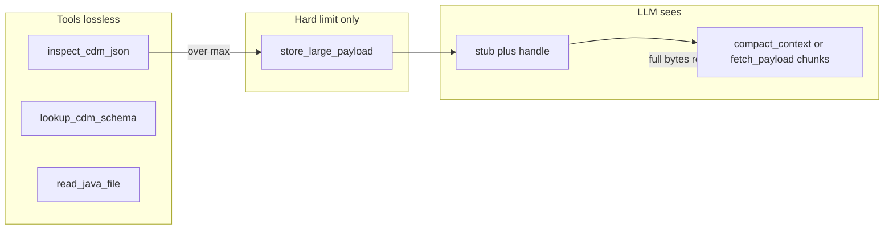

# Plan: Replace implicit compaction with an explicit `compact_context` tool + system prompt

## 1. Goals (what “success” means)

| Goal | What it implies |
|------|-----------------|
| **Less hallucination** | The model must not invent structure/imports when the real tree/schema was stripped. It should **choose** to pull exact bytes (or structured slices) via tools, not guess. |
| **Stop silent filtering** | Nothing important disappears **without** the model knowing (flags, handles, explicit “you are not seeing X unless you fetch”). |
| **“Send everything”** | You cannot put unbounded JSON in one chat message. The honest version of this goal is: **100% of data remains reachable losslessly** (same bits as today’s `store_large_payload`), with **explicit** retrieval, not **silent** truncation. |

So the rewrite is: **from opaque middleware → explicit, auditable tool contract + prompt discipline.**

---

## 2. Current behavior to replace or narrow

**Today (agent middleware in [fpml_cdm/java_gen/agent.py](fpml_cdm/java_gen/agent.py)):**

- `compact_tool_result_for_llm` runs on **every** tool result: caps, head/tail file reads, slim `lookup_cdm_schema`, giant `inspect_cdm_json` → stub + summary fields, etc.
- `_SMALL_CONTEXT_MODE` / `_choose_inspect_detail` changes lookup compaction at startup.
- `inspect_cdm_json(..., detail=...)` is documented in [fpml_cdm/java_gen/tools.json](fpml_cdm/java_gen/tools.json) but **does not** shrink output in [fpml_cdm/java_gen/tools.py](fpml_cdm/java_gen/tools.py).

**Problems this plan addresses:**

- The model **did not ask** to drop the tree; it still “answers” as if it saw it → hallucination.
- Handles and `fetch_payload` are easy to skip or misuse under iteration pressure.

---

## 3. Target architecture

### 3.1 Principle

- **Raw tool implementations** (`inspect_cdm_json`, `lookup_cdm_schema`, `read_java_file`, etc.) return **full, lossless dicts** (subject only to hard OS/process limits you keep for safety, documented).
- **No** `compact_tool_result_for_llm` on the hot path as default behavior—or it becomes a **no-op** that only enforces an absolute safety ceiling with **mandatory** store+stub (see 3.3).

### 3.2 New first-class tool: `compact_context`

**Purpose:** The **only** approved place that turns a large blob into something that fits the **next** LLM turn, while preserving recoverability.

**Suggested responsibilities:**

1. **Input:** One of:
   - `handle` (already stored payload), or
   - `tool_message_index` / `message_ref` (if you support addressing prior tool outputs), or
   - `kind` + inline payload id — simplest v1 is **`handle`-only** since you already have `store_large_payload`.

2. **Operation modes** (pick one design; document in schema):
   - **Passthrough slice:** `fetch_payload`-style but named as part of “compaction workflow” (might duplicate `fetch_payload` — see 4.2).
   - **Structured projection:** e.g. “only `tree`”, “only `type_registry` keys”, “only paths matching prefix” — **only if** the output includes **`omitted_artifact: { handle, sha256, bytes }`** so nothing is pretend-lossless.

3. **Output:** Always JSON with:
   - `success`
   - Either `chunk` / `done` / `offset` / `total_chars` **or** a clear `error`
   - **`provenance`**: what was included, what was **not** included and where to get it (`handle`, byte range, or next tool call).

**Important:** If the real goal is “model always has access to full data,” **`compact_context` should not delete** — it should **route** (slice, index, or point to handle). Deletion belongs only in **user-approved** summarization (optional future tool).

### 3.3 Absolute safety valve (non-negotiable)

Even with “send everything,” APIs have **max message size**. Keep a **single** internal path:

- If a serialized tool result exceeds **hard max**, **always** `store_large_payload` + return a **minimal stub** that **only** contains: `stored`, `handle`, `sha256`, `bytes`, and **one line**: `next_step: "Call compact_context or fetch_payload with this handle"`.

That is not “filtering for convenience”; it’s **physical constraint** with **lossless** recovery.

---

## 4. Relationship to existing tools

### 4.1 `fetch_payload`

Options:

- **A (minimal churn):** Keep `fetch_payload` as the low-level byte pager; **`compact_context`** is a thin wrapper that adds **prompt-friendly metadata** and maybe **default limits** aligned with the model’s working style.
- **B (single tool):** Deprecate `fetch_payload` for the LLM and fold paging into `compact_context` only (fewer tools, clearer story).

Pick A or B and update `tools.json`, `TOOL_DISPATCH`, tests accordingly.

### 4.2 `inspect_cdm_json`

- Stop replacing full inspect with summary-only stub in middleware.
- Either:
  - **Always store** inspect result server-side at call time and return **stub + handle** when over threshold (model **always** uses `compact_context`/`fetch_payload`), or
  - Return full JSON until over threshold, then store — same outcome.

Document in system prompt: **“You will not receive the full inspect in one message when large; use …”**

### 4.3 `lookup_cdm_schema`

- Remove `_SMALL_CONTEXT_MODE`-based property slimming from agent; **full** schema dict from tool.
- If too large → store + stub (same safety valve).

---

## 5. System prompt changes (concrete sections to add/replace)

Location: [fpml_cdm/java_gen/prompt_blocks.py](fpml_cdm/java_gen/prompt_blocks.py) (`CORE`, new blocks, `build_system_prompt`).

Draft **sections** (not final wording):

1. **Truth boundary** — “You only know CDM structure from **tool outputs** or **`fetch_payload`/`compact_context` chunks**. Do not invent paths, types, or imports.”

2. **Large outputs protocol** — When a tool result contains `stored: true` and a `handle`: **do not** proceed to codegen until you’ve retrieved the parts you need (or explicitly note in `finish` that you relied on summaries — if you allow that).

3. **`compact_context` contract** — When to call it vs `fetch_payload`. **Iteration budget:** prefer **batched** fetches (plan N offsets) over blind patching.

4. **Inspect workflow** — Order: `inspect_cdm_json` → if stub, **sequential or parallel** `compact_context`/`fetch_payload` to rebuild `tree` / `type_registry` sections as needed.

5. **Anti-hallucination rules for imports** — Keep existing import rules but tie them to **“must appear in retrieved JSON”** not to memory.

6. **Failure mode** — If uncertain, call `inspect_cdm_json` again or fetch more; **do not** guess.

Optional: **short checklist** the model must follow before `write_java_file`.

Existing `CORE` already mentions handles and `fetch_payload`; extend or replace so **`compact_context`** is first-class if you add it.

---

## 6. Agent loop changes (checklist)

1. **Remove or gut** `compact_tool_result_for_llm` from default path; replace with optional `maybe_store_oversized_only(result)` that **only** stores + stub when over hard limit.

2. **Remove** `_SMALL_CONTEXT_MODE` and `_choose_inspect_detail` **or** repurpose: e.g. only adjust **system prompt text** (“this trade is large”) without changing tool outputs.

3. **Preflight:** Today preflight calls `inspect_cdm_json` twice for policy. Replace with:
   - lightweight **node count** only (new small function or minimal parse) **or** accept cost of full inspect once and store handle for prompt injection.

4. **`build_system_prompt`:** May need **preflight block** that includes **only** safe summaries (counts, root type) + **handle** to full inspect if you want zero data loss in prompt assembly.

5. **Trace / logging:** Log **raw** tool bytes to `compacted` or rename to `tool_io.jsonl` with both `raw` and `sent_to_llm` if you still need debugging.

---

## 7. `tools.json` and OpenAPI surface

- Add **`compact_context`** definition: parameters, return schema, descriptions that state **lossless when using handle**.
- Update **`inspect_cdm_json`** description: remove implication that “agent compacts”; say **“large results returned as stored handle”** if that’s the new behavior.
- Ensure **tool ordering** in tests ([tests/test_java_gen/test_agent.py](tests/test_java_gen/test_agent.py) expected name list) matches.

---

## 8. Testing strategy

| Area | Tests to add/update |
|------|---------------------|
| Roundtrip | Large blob → store → `compact_context`/`fetch_payload` → bytes match ([tests/test_java_gen/test_compact_context.py](tests/test_java_gen/test_compact_context.py)). |
| No silent drop | Assert **sent-to-LLM** string for `inspect_cdm_json` over limit contains `handle` and does **not** pretend to include `tree`. |
| Agent integration | Mock LLM that calls `compact_context` after inspect stub; verify trace. |
| Regression | Small trades: behavior unchanged vs baseline (compile/run). |
| Env | Document `FPML_JAVA_GEN_MAX_TOOL_CHARS` as **hard ceiling** only. |

---

## 9. Risks and mitigations

| Risk | Mitigation |
|------|------------|
| Context still too small | Strong prompt + default **chunk size**; optional “summary tool” is **explicitly labeled** as lossy. |
| More tool calls / slower | Batched fetch in one user message with multiple tool calls; raise `max_tool_calls` slightly for large `total_nodes`. |
| Model ignores handles | Stub message type **must** be visually loud; optional **automatic** user nudge when `inspect` returns `stored: true` (agent-injected message, not silent compaction). |
| Duplication `fetch_payload` vs `compact_context` | Merge or differentiate clearly in prompt. |

---

## 10. Deliverables checklist (implementation phase)

1. [fpml_cdm/java_gen/tools.py](fpml_cdm/java_gen/tools.py): `compact_context` implementation + `TOOL_DISPATCH`.
2. [fpml_cdm/java_gen/tools.json](fpml_cdm/java_gen/tools.json): schema + descriptions.
3. [fpml_cdm/java_gen/agent.py](fpml_cdm/java_gen/agent.py): remove slimming/truncation from default path; optional oversize-only store; optional nudges.
4. [fpml_cdm/java_gen/prompt_blocks.py](fpml_cdm/java_gen/prompt_blocks.py): new/updated blocks per §5.
5. Tests: [tests/test_java_gen/test_tools.py](tests/test_java_gen/test_tools.py), [tests/test_java_gen/test_agent.py](tests/test_java_gen/test_agent.py), [tests/test_java_gen/test_compact_context.py](tests/test_java_gen/test_compact_context.py) aligned and passing.
6. Optional env doc: list env vars and semantics.

---

## 11. Decisions to lock before coding

1. **Literal “send everything in one prompt”** — not possible; confirm stakeholder language: **“losslessly available via tools.”**
2. **`compact_context` vs `fetch_payload`** — one tool or two (§4.1).
3. **`read_java_file`** — may it ever truncate, or always handle+pager for large files?
4. **Automatic user message** when stub is returned — yes/no (recommended yes for anti-hallucination).

---

## 12. Data flow (target)

---

*This document captures the agreed design direction; implementation should follow after these decisions are finalized.*

---

## Implementation status (done)

- **`compact_context`** in [`fpml_cdm/java_gen/tools.py`](fpml_cdm/java_gen/tools.py); registered in [`tools.json`](fpml_cdm/java_gen/tools.json) and [`TOOL_DISPATCH`](fpml_cdm/java_gen/agent.py).
- **Oversize-only path**: [`maybe_store_oversized_tool_result_for_llm`](fpml_cdm/java_gen/agent.py) (alias `compact_tool_result_for_llm`); full tool JSON below `FPML_JAVA_GEN_MAX_TOOL_CHARS` is unchanged. Debug log: `tool_io.jsonl`.
- **Pre-send prompt budget**: [`_presend_compact_messages`](fpml_cdm/java_gen/agent.py) + env vars in [`fpml_cdm/java_gen/ENV_VARS.md`](fpml_cdm/java_gen/ENV_VARS.md).
- **Preflight**: single `inspect_cdm_json`; `preflight_large_trade` + [`LARGE_TRADE_ALERT`](fpml_cdm/java_gen/prompt_blocks.py) in system prompt.
- **User nudge** when any tool result has `stored: true` in a turn.
- **Tests**: [`tests/test_java_gen/test_compact_context.py`](tests/test_java_gen/test_compact_context.py), updated [`tests/test_java_gen/test_agent.py`](tests/test_java_gen/test_agent.py).
